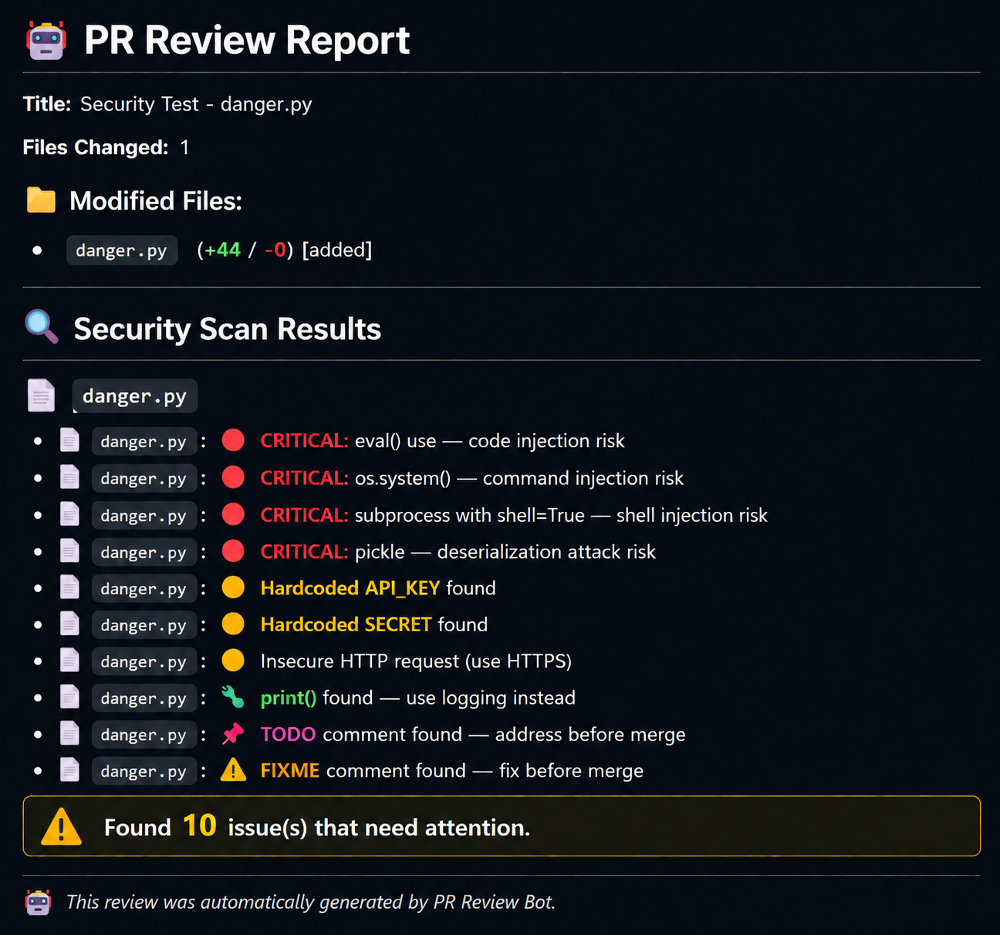

# 🤖 PR Review Bot

<p align="center">
  
  
  
  
</p>

<p align="center">
<b>AI-powered GitHub Pull Request Review Bot for Automated Security and Code Quality Analysis.</b>
</p>

---

# 📖 Overview

PR Review Bot automatically reviews GitHub Pull Requests and detects security vulnerabilities, hardcoded secrets, and code quality issues before code is merged.

Instead of manually reviewing every Pull Request, the bot performs automated static analysis and posts a detailed review directly on GitHub.

---

# 📸 Demo

> Replace this image after uploading it into your repository.

<p align="center">

</p>

---

# ✨ Key Highlights

- 🔴 Security Vulnerability Detection
- 🟡 Hardcoded Secret Detection
- 🟢 Code Quality Analysis
- ⚡ Automatic PR Reviews
- 💬 GitHub Review Comments
- 📂 Multi-file Support
- 🚀 FastAPI Backend
- 🔗 GitHub Webhook Integration

---

# 🛡️ Security Checks

### Critical

- `eval()`
- `exec()`
- `os.system()`
- `pickle.load()`
- `subprocess(shell=True)`

### Medium

- Hardcoded API Keys
- Passwords
- Tokens
- AWS Keys
- HTTP Requests

### Minor

- print()
- TODO
- FIXME
- Debug Statements

---

# 🏗️ Architecture

```text
Developer
      │
      ▼
Create / Update Pull Request
      │
      ▼
GitHub Webhook
      │
      ▼
FastAPI Server
      │
      ▼
Security Scanner
      │
      ▼
Generate Report
      │
      ▼
Post Review Comment
```

---

# 🛠️ Tech Stack

- Python
- FastAPI
- PyGithub
- GitHub Apps
- GitHub Webhooks
- ngrok

---

# 📂 Project Structure

```text
pr-review-bot/
│
├── main.py
├── requirements.txt
├── README.md
├── .gitignore
├── LICENSE
├── .env
├── images/
│     └── pr-review-report.png
└── private-key.pem
```

---

# 🚀 Installation

Clone the repository.

```bash
git clone https://github.com/ravsaheb7841/pr-review-bot.git

cd pr-review-bot
```

Create virtual environment.

### Windows

```bash
python -m venv pr_bot_env

pr_bot_env\Scripts\activate
```

### Linux/macOS

```bash
python3 -m venv pr_bot_env

source pr_bot_env/bin/activate
```

Install dependencies.

```bash
pip install -r requirements.txt
```

---

# ⚙️ Environment Variables

Create a `.env` file.

```env
GITHUB_APP_ID=

GITHUB_WEBHOOK_SECRET=

GITHUB_TOKEN=
```

---

# ▶️ Run

Start FastAPI.

```bash
uvicorn main:app --reload
```

Start ngrok.

```bash
ngrok http 8000
```

Update your GitHub App Webhook URL.

---

# 🧪 Example Scan

```python
def process(data):
    return eval(data)

API_KEY="sk-test"

print("Hello")
```

Bot Output

```text
🔴 eval() detected
🟡 Hardcoded API Key detected
🟢 print() statement detected

Total Issues Found: 3
```

---

# 🎯 Future Improvements

- AI-powered Fix Suggestions
- Inline Review Comments
- Multi-language Support
- Docker Deployment
- GitHub Actions
- Security Dashboard
- Slack Notifications

---

# 🤝 Contributing

Contributions are welcome.

1. Fork Repository
2. Create Feature Branch
3. Commit Changes
4. Push Changes
5. Open Pull Request

---

# 📄 License

Licensed under the MIT License.

---

# 👨‍💻 Author

**Ravsaheb Bansode**

<p>
<a href="https://github.com/ravsaheb7841">

</a>

<a href="https://www.linkedin.com/in/ravsaheb-bansode/">

</a>
</p>

---

<p align="center">

⭐ If you found this project useful, consider giving it a star!

</p>