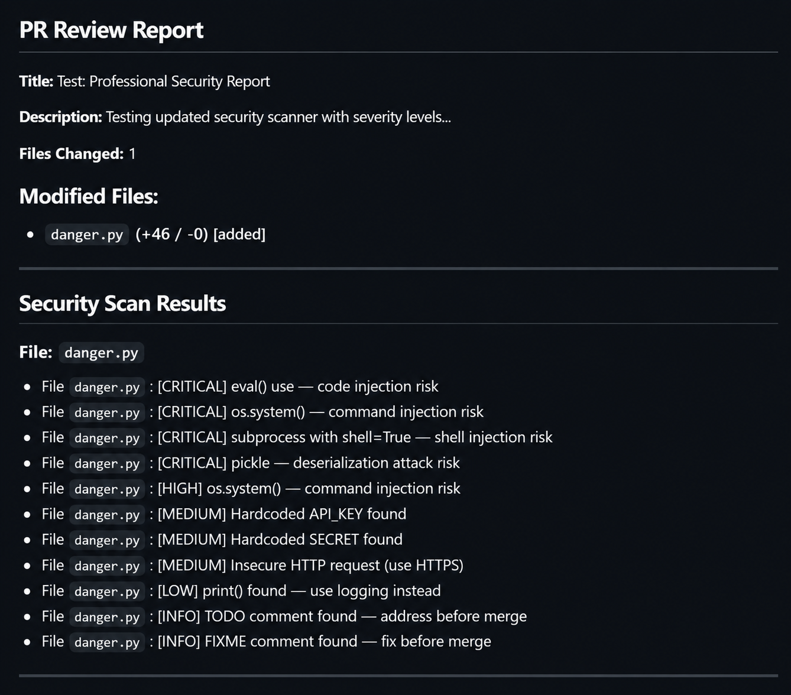
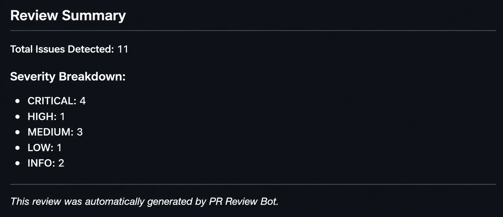

# 🤖 PR Review Bot

<p align="center">
  
  
  
  
</p>

<p align="center">
  <b>AI-powered GitHub Pull Request Review Bot for Automated Security & Code Quality Analysis.</b>
</p>

---

## 📖 Overview

PR Review Bot is a GitHub App that automatically reviews Pull Requests to detect security vulnerabilities, hardcoded secrets, and code quality issues before code is merged.

The bot performs automated static analysis whenever a Pull Request is opened or updated and posts a detailed review directly on GitHub, helping developers identify potential problems early in the development process.

---

## 🚀 Installation

Install the GitHub App using the link below.

<p align="center">

### 👉 [Install PR Review Bot](https://github.com/apps/PR-Review-Bot-Ravsaheb-Bansode/installations/new)

</p>

### Usage

1. Install the GitHub App.
2. Select your GitHub account or organization.
3. Choose the repositories to monitor.
4. Open or update a Pull Request.
5. The bot automatically analyzes the code and posts a review comment.

---

## 📸 Demo

<p align="center">
  
  
</p>

---

## ✨ Features

- 🔍 Automated Pull Request Review
- 🛡️ Security Vulnerability Detection
- 🔐 Hardcoded Secret Detection
- 📊 Code Quality Analysis
- 💬 Automatic Review Comments on Pull Requests
- ⚡ FastAPI-powered Webhook Server
- ☁️ Deployable on Render
- 🔗 GitHub App Integration

### Security Checks

| Severity | Checks |
|----------|--------|
| 🔴 Critical | `eval()`, `exec()`, `os.system()`, `pickle.load()`, `subprocess(shell=True)` |
| 🟡 Medium | Hardcoded API Keys, Passwords, Tokens, Insecure HTTP URLs |
| 🟢 Low | `print()`, `console.log()`, TODO, FIXME Comments |

---

## 🏗️ Architecture

```text
Developer
      │
      ▼
Create / Update Pull Request
      │
      ▼
GitHub Webhook
      │
      ▼
FastAPI Server
      │
      ▼
Security Scanner
      │
      ▼
Generate Review Report
      │
      ▼
Post Comment on Pull Request
```

---

## 🛠️ Tech Stack

| Component | Technology |
|----------|------------|
| Language | Python 3.10+ |
| Backend | FastAPI |
| GitHub Integration | GitHub Apps, PyGithub |
| Deployment | Render |
| Local Testing | ngrok |
| Scanner | Custom Pattern Matching |

---

## 📂 Project Structure

```text
pr-review-bot/
│
├── main.py
├── requirements.txt
├── README.md
├── LICENSE
├── .gitignore
├── .env
├── images/
│   ├── pr-review-report_1.png
│   └── pr-review-report_2.png
└── private-key.pem
```

---

## 🚀 Developer Setup

### Clone the Repository

```bash
git clone https://github.com/ravsaheb7841/pr-review-bot.git
cd pr-review-bot
```

### Create a Virtual Environment

**Windows**

```bash
python -m venv pr_bot_env
pr_bot_env\Scripts\activate
```

**Linux/macOS**

```bash
python3 -m venv pr_bot_env
source pr_bot_env/bin/activate
```

### Install Dependencies

```bash
pip install -r requirements.txt
```

### Configure Environment Variables

Create a `.env` file.

```env
GITHUB_APP_ID=YOUR_APP_ID
GITHUB_WEBHOOK_SECRET=YOUR_WEBHOOK_SECRET
GITHUB_TOKEN=YOUR_GITHUB_TOKEN
```

### Run the Application

```bash
uvicorn main:app --reload
```

### Test Using ngrok

```bash
ngrok http 8000
```

---

## 🧪 Example Scan

### Sample Vulnerable Code

```python
def process(data):
    return eval(data)

API_KEY = "sk-test"

print("Hello")
```

### Bot Output

```text
## PR Review Report

File: test.py

[CRITICAL] eval() detected — Code Injection Risk

[MEDIUM] Hardcoded API_KEY detected

[LOW] print() statement found — Consider using logging
```

---

## 📄 License

This project is licensed under the **MIT License**.

---

## 👨‍💻 Author

**Ravsaheb Bansode**

<p>
<a href="https://github.com/ravsaheb7841">

</a>

<a href="https://www.linkedin.com/in/ravsaheb-bansode/">

</a>
</p>

---

<p align="center">
⭐ If you found this project useful, consider giving it a star.
</p>